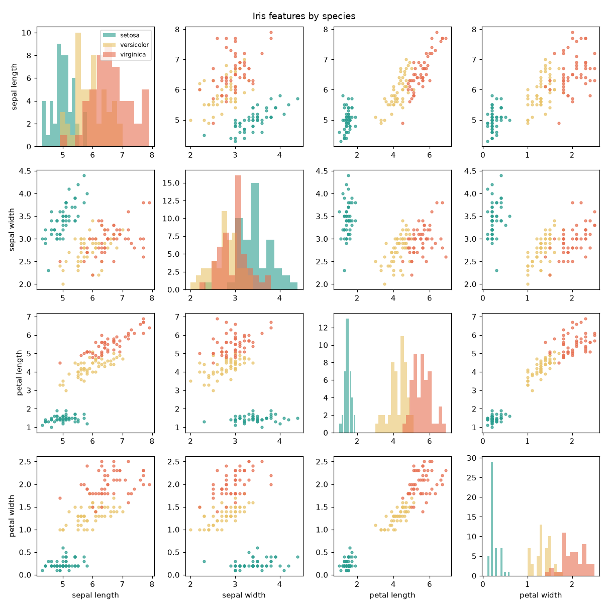
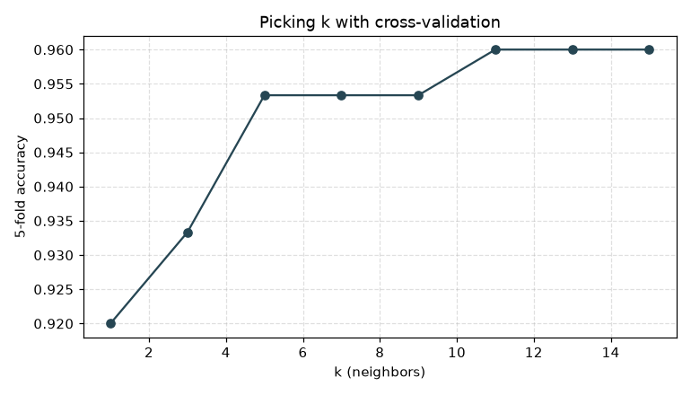

# Iris Explorer


I started this as a single scatter plot and grew it into a small data project: load the Iris dataset, summarize it, plot every feature pair, and classify the species with a k-nearest-neighbors model I wrote from scratch (no scikit-learn), then pick k with cross-validation.



## What it does

- Loads `data/iris.csv` and checks it (missing columns and bad values report the line number)
- Prints the mean and standard deviation of each feature per species
- k-NN classifier: standardizes features, uses Euclidean distance, majority vote with ties going to the closest neighbor
- 5-fold cross-validation over odd k from 1 to 15, then a hold-out check with a confusion matrix
- Saves a 4x4 pair grid and an accuracy-vs-k chart

## Run it

```bash
pip install -e ".[dev]"
python -m iris_explorer --plots figures
pytest -q
```

Sample output:

```
5-fold accuracy by k
  k=1  0.920
  k=5  0.953
  k=11 0.960
Best k: 11
Hold-out accuracy: 1.000
```



## What I learned

Petal length and width separate the species far better than the sepal measurements, which the pair grid makes obvious. Standardizing mattered: without it the larger sepal values dominate the distance. Setosa is always easy; the few mistakes are between versicolor and virginica.

## Layout

```
src/iris_explorer/  data.py (load + stats), knn.py (classifier + CV), plots.py, cli.py
tests/              pytest tests for data loading, the classifier and the CLI
data/iris.csv       the classic Fisher/Anderson Iris dataset (150 samples)
```
